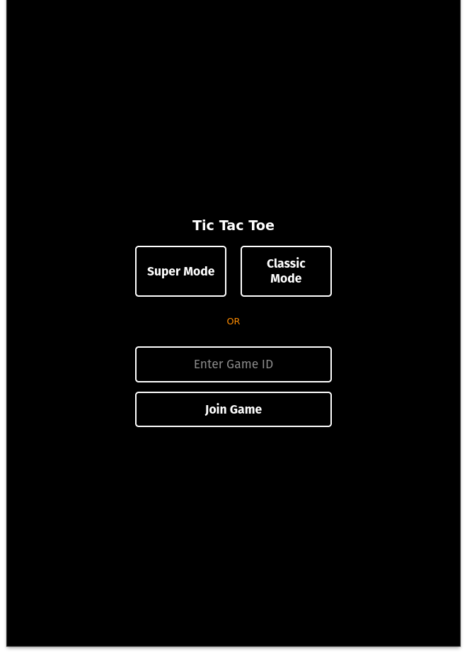
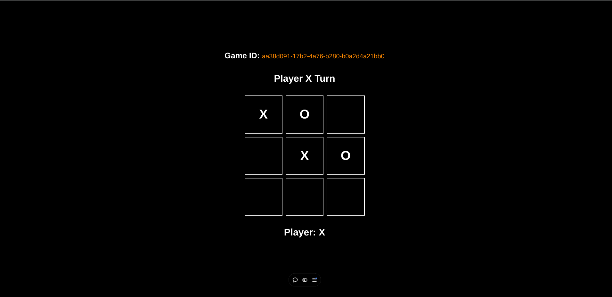

# Tic-Tac-Toe
A full-stack Tic-Tac-Toe game built using React.js for the frontend and Spring Boot for the backend.




## Features
- Interactive UI built with React.js.
- Backend API powered by Spring Boot.
- Multiplayer support.
- Real-time game updates.
- Modern, responsive design.
## Prerequisites
- Node.js and npm installed.
- Java Development Kit (JDK) 11+.
- Maven for dependency management.
## Installation
- Backend (Spring Boot)
  - Navigate to the [backend](backend) directory:

    ``` bash
    cd backend
    ```
  - Build the project:
    ``` bash
    mvn clean install
    ```
  - Run the backend server:
    ``` bash
    mvn spring-boot:run
    ```
- Frontend (React)
  - Navigate to the [frontend](frontend) directory:
    ``` bash
    cd frontend
    ```
  - Install dependencies:
    ``` bash
    npm install
    ```
  - Start the development server:
    ``` bash
    npm run dev
    ```
## Usage
- Start the backend and frontend servers.
- Open your browser and navigate to http://localhost:5173 
- Play the game!
## Contribution
- Fork the repository.
- Create a new branch for your feature or bug fix.
- Commit and push your changes.
- Open a pull request.

